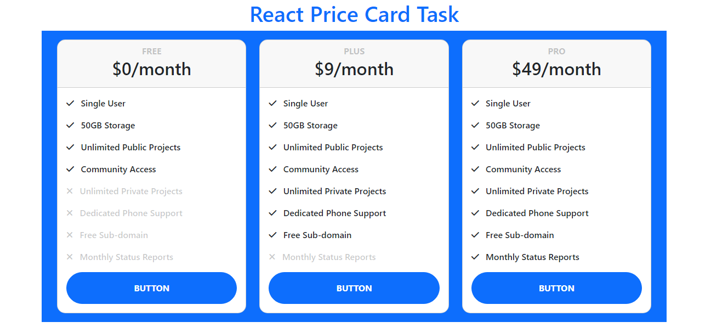

# React-Price-Card-Task

This is a sample price-card showing website which was designed by me using React. It's Guvi-Zen class Roadmap session: Day-22 and React : Day-2 Task.<b> This is my first React Project!</b>

## Tech Stack

- HTML
- CSS
- Javascript
- Bootstrap
- React

## Features

- Responsive and attractive Design

## Lessons Learned

I learned to create react project as well as to include components in it which helped me to understand how react project works in a browser.

## Website

[React-Price-Card-Task](https://react-price-card-task-two.vercel.app/)

## Screenshots

## Setup

Followig are the requirements to run this project:
- Node Package Manager (NPM)
- React

## Feedback

If you have any feedback, please reach out to me at duraiaravindhraj.e.com
